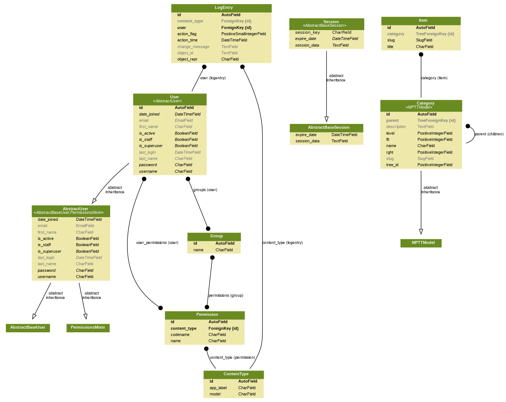

# django-categories-example-app
A basic app to show how to have categories in Django with an optional
tree structure and breadcrumbs in each page.

This app shows the concepts explained at: https://simpleit.rocks/python/django/categories-with-django-cbv

And the demo at: https://django-categories-example-app.herokuapp.com/

# Installation

~~~ bash
python3 -m venv ~/.virtualenvs/django-categories-example-app
source ~/.virtualenvs/django-categories-example-app/bin/activate
pip install -r requirements.txt
./manage.py migrate
~~~

Run example site: `./manage.py runserver`.

# Models

# URLs

